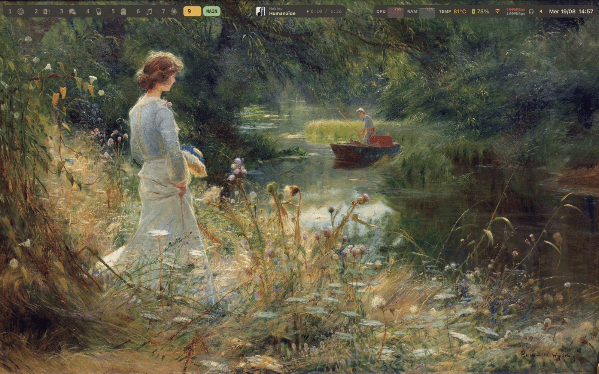

# Dotfiles

Configuration macOS Apple Silicon : AeroSpace, SketchyBar, Ghostty, Neovim, tmux, zsh.
Thème Gruvbox Dark sur l'ensemble de la pile.



## Composants

| Rôle | Outil |
| --- | --- |
| Gestionnaire de fenêtres | [AeroSpace](https://github.com/nikitabobko/AeroSpace) |
| Barre de statut | [SketchyBar](https://github.com/FelixKratz/SketchyBar) + [SbarLua](https://github.com/FelixKratz/SbarLua) |
| Bordure de fenêtre focalisée | [JankyBorders](https://github.com/FelixKratz/JankyBorders) |
| Terminal | [Ghostty](https://ghostty.org) |
| Éditeur | [Neovim](https://neovim.io) + [LazyVim](https://www.lazyvim.org) |
| Multiplexeur | [tmux](https://github.com/tmux/tmux) + [tpm](https://github.com/tmux-plugins/tpm) |
| Invite shell | [starship](https://starship.rs) |
| `ls` | [eza](https://github.com/eza-community/eza) |
| Recherche floue | [fzf](https://github.com/junegunn/fzf) |
| Navigation de dossiers | [zoxide](https://github.com/ajeetdsouza/zoxide) |
| Gestionnaire de fichiers | [yazi](https://github.com/sxyazi/yazi) |
| Versions de langages | [mise](https://github.com/jdx/mise) |
| Pager git | [delta](https://github.com/dandavison/delta) |
| Métriques CPU/GPU | [macmon](https://github.com/vladkens/macmon) |

## Thème

Gruvbox Dark. La palette n'est pas centralisée : chaque outil la définit chez lui.

| Fichier | Contenu |
| --- | --- |
| `home/.config/sketchybar/colors.lua` | Palette de référence, en `0xAARRGGBB` |
| `home/.config/aerospace/aerospace.toml` | Couleurs JankyBorders, alignées sur `colors.lua` |
| `home/.config/borders/bordersrc` | Mêmes couleurs, chemin de secours (voir plus bas) |
| `home/.config/ghostty/config` | `theme = Gruvbox Dark` (thème intégré à Ghostty) |
| `home/.config/eza/theme.yml` | Couleurs par type de fichier, en hexadécimal |
| `home/.config/starship.toml` | `palette = 'gruvbox_dark'`, définie sous `[palettes.gruvbox_dark]` |
| `home/.zshrc` | `FZF_DEFAULT_OPTS` |
| `home/.config/tmux/tmux.conf` | Plugin `egel/tmux-gruvbox` |
| `home/.config/nvim/lua/plugins/colorscheme.lua` | `ellisonleao/gruvbox.nvim` |
| `home/.gitconfig` | `syntax-theme = gruvbox-dark` pour delta |

Toute nouvelle couleur doit venir de `colors.lua` ou de la palette Gruvbox officielle.

## Installation

Prérequis : [Homebrew](https://brew.sh) et les Xcode Command Line Tools
(`xcode-select --install`).

```bash
git clone https://github.com/LaTable007/dotfiles.git ~/dotfiles
```

**Sauvegarder les configurations existantes avant de continuer.** `stow` refuse
d'écraser un fichier réel, et `install.sh` ne supprime rien de lui-même : cette
étape est délibérément manuelle.

```bash
mv ~/.zshrc ~/.zshrc.backup
mv ~/.gitconfig ~/.gitconfig.backup
for d in aerospace borders eza gh ghostty nvim sketchybar tmux; do
  [ -e ~/.config/$d ] && mv ~/.config/$d ~/.config/$d.backup
done
[ -e ~/.config/starship.toml ] && mv ~/.config/starship.toml ~/.config/starship.toml.backup
```

Puis :

```bash
cd ~/dotfiles && ./install.sh
```

`install.sh` installe les paquets du `Brewfile`, déploie les symlinks avec
`stow`, clone tpm dans `~/.tmux/plugins/tpm` et compile SbarLua, qui n'est pas
distribué par Homebrew et sans lequel la configuration Lua de SketchyBar ne
démarre pas.

Redémarrer la session pour appliquer. Dans tmux, `prefix + I` installe les
plugins.

Le déploiement se vérifie ainsi :

```bash
ls -la ~/.zshrc
```

La sortie doit montrer un lien vers `~/dotfiles/home/.zshrc`.

## Raccourcis

### Hyper key

AeroSpace utilise `cmd-ctrl-alt-shift` comme unique modificateur. Cette
combinaison est envoyée par la fonction « Hyper Key » de Raycast quand Caps Lock
est maintenu.

Ce choix est imposé par le clavier : sur AZERTY belge, Option/Alt seul sert à
taper `@ # { } [ ] |`, et macOS ne distingue pas Option gauche et droite. Un
modificateur seul entrerait aussi en conflit avec `<A-j>`/`<A-k>` de LazyVim.
Une combinaison à quatre modificateurs que rien d'autre n'utilise évite les deux.

Dans les tableaux ci-dessous, **Hyper** = Caps Lock maintenu.

### Particularité AZERTY

AeroSpace interprète les notations de touches par **position physique** sur un
clavier US QWERTY, pas par le caractère imprimé sur la touche. Sur AZERTY belge,
trois touches sont décalées, d'où le remapping dans
`[key-mapping.key-notation-to-key-code]` :

| Notation écrite dans la config | Touche physique visée | Étiquette AZERTY |
| --- | --- | --- |
| `m` | position QWERTY du `;` | **M** |
| `semicolon` | position QWERTY de la `,` | **;** |
| `comma` | position QWERTY du `m` | **,** |

Une fois ce remapping en place, les raccourcis se lisent tels qu'imprimés sur les
touches.

### Mode `main`

| Raccourci | Action |
| --- | --- |
| `Hyper` + `h` `j` `k` `l` | Déplacer le focus |
| `Hyper` + `1`…`9` | Aller au workspace |
| `Hyper` + `Tab` | Revenir au workspace précédent |
| `Hyper` + `/`\* | Disposition en tuiles (horizontal/vertical) |
| `Hyper` + `,` | Disposition accordéon |
| `Hyper` + `;` | Entrer en mode `service` |

\* Seules `m`, `semicolon` et `comma` sont réalignées. `slash` vise donc toujours
la position physique du `/` d'un QWERTY, dont l'étiquette diffère sur AZERTY.

### Mode `service`

Hyper contient déjà Shift, donc les actions qui utilisaient `alt-shift-*` ne
peuvent plus être des accords directs. Elles vivent dans un mode : `Hyper` + `;`
pour y entrer, puis une touche simple déclenche l'action.

| Touche | Action | Retour au mode `main` |
| --- | --- | --- |
| `Échap` | Recharger la configuration | oui |
| `r` | Réinitialiser la disposition | oui |
| `f` | Basculer flottant / tuilé | oui |
| `Retour arr.` | Fermer toutes les fenêtres sauf l'active | oui |
| `h` `j` `k` `l` | Déplacer la fenêtre | oui |
| `Maj` + `h` `j` `k` `l` | Fusionner avec la fenêtre voisine | oui |
| `1`…`9` | Envoyer la fenêtre au workspace | oui |
| `Tab` | Envoyer le workspace à l'écran suivant | oui |
| `-` / `=` | Redimensionner par pas de 50 | non, reste en `service` |

`-` et `=` restent en mode `service` pour permettre les appuis répétés ; `Échap`
en sort.

### tmux

Préfixe : `Ctrl-a`.

| Raccourci | Action |
| --- | --- |
| `prefix` + `v` | Diviser en deux colonnes |
| `prefix` + `-` | Diviser en deux lignes |
| `prefix` + `h` `j` `k` `l` | Redimensionner le panneau de 5 |
| `prefix` + `m` | Plein écran sur le panneau |
| `prefix` + `r` | Recharger la configuration |
| `prefix` + `I` | Installer les plugins (tpm) |
| `v` / `y` en copy-mode | Sélectionner / copier (bindings vi) |

Les sessions sont sauvegardées toutes les 15 minutes et restaurées au démarrage
(`tmux-resurrect` + `tmux-continuum`).

### Shell

| Raccourci | Action |
| --- | --- |
| `Ctrl-r` | Recherche floue dans l'historique |
| `Ctrl-t` | Recherche floue de fichiers |
| `↑` / `↓` | Historique filtré par le début de ligne |
| `cd <fragment>` | zoxide : saut vers un dossier récemment visité |

`cd` reste `cd` quand l'argument est un vrai chemin.

## Maintenance

Mettre à jour Homebrew, installer ce qui manque et mettre à jour l'existant :

```bash
./update_dotfiles.sh
```

Après avoir installé un paquet à la main, régénérer l'inventaire :

```bash
brew bundle dump --describe --force --file=Brewfile
```

Le fichier généré liste tout ce qui est installé, y compris les installations
ponctuelles. Le relire et élaguer avant de commiter.

Vérifier que tout ce qui est déclaré est présent :

```bash
brew bundle check --no-upgrade --file=Brewfile
```

Sans `--no-upgrade`, la commande signale aussi les paquets simplement obsolètes.

Désinstaller ce qui n'est plus déclaré dans le `Brewfile` :

```bash
brew bundle cleanup --file=Brewfile
```

**À lancer manuellement uniquement**, jamais depuis un script : la commande
supprime tout paquet absent du `Brewfile`, y compris ceux installés
délibérément et pas encore déclarés.

## Notes

### JankyBorders

AeroSpace n'a pas d'indicateur natif de fenêtre focalisée. JankyBorders est lancé
par `after-startup-command` dans `aerospace.toml`, pas comme service Homebrew.

Les arguments passés en ligne de commande priment sur
`home/.config/borders/bordersrc`, qui n'est lu que si `borders` démarre sans
argument. Les deux fichiers sont gardés identiques pour qu'aucun des deux
chemins ne donne un résultat différent, mais `aerospace.toml` fait foi.

### Lecteur média

L'item central affiche la pochette, le titre de la piste et un compteur
`position / durée` avec l'état de lecture. L'artiste est volontairement omis :
la pochette juste à gauche le donne déjà, et le couple artiste-titre occupait
la moitié de la barre. Pour le rétablir, reconstruire `text` à partir de
`fields[2]` dans `sync_metadata`.

SketchyBar sait normalement faire cela nativement, via l'événement
`media_change` et l'image intégrée `media.artwork`. Les deux sont inutilisables
sur macOS 26 : Apple a fermé l'API MediaRemote, et même
`sketchybar --trigger media_change` reste sans effet. Deux sources se partagent
donc le travail :

| Source | Donnée | Portée |
| --- | --- | --- |
| `nowplaying-cli` | titre, artiste, pochette | toute application |
| `helpers/music_position.applescript` | position, durée, état | Music uniquement |

MediaRemote expose bien une position, mais inexploitable : sa clé
`ElapsedTime` ne se rafraîchit qu'aux transitions lecture/pause, `PlaybackRate`
renvoie l'état précédent, et aucun horodatage ne permet d'extrapoler. Le
raccourci `nowplaying-cli get elapsedTime` renvoie en plus toujours 0, alors
que la clé brute, elle, porte une valeur. AppleScript reste exact.

L'item bat à la seconde pour que le compteur défile, mais n'interroge le
système que toutes les 5 secondes : entre deux relevés la position est
extrapolée en Lua, sans lancer un seul processus. En contrepartie, une pause
survenue entre deux relevés peut laisser le compteur avancer jusqu'à cinq
secondes de trop avant de se corriger.

Le script AppleScript impose des entiers : en locale française, un réel
reviendrait avec une virgule décimale, que le `tonumber()` de Lua rejette. Il
teste aussi `is running` avant tout `tell`, sans quoi il lancerait Music à
chaque relevé si l'application était fermée.

L'item ne s'affiche que si Music est la source. Un navigateur ou Spotify
donnerait bien un titre via `nowplaying-cli`, mais pas de position : une vidéo
YouTube apparaissait alors avec son titre et la pochette du morceau précédent,
l'extraction d'image échouant sans que l'ancienne soit retirée. Plutôt que de
rattraper ce cas, toute source autre que Music masque l'item entier.

Ajouter Spotify demanderait sa propre branche : son API AppleScript exprime la
durée en millisecondes, pas en secondes.

La pochette n'est réextraite qu'au changement de piste, et écrite
alternativement dans `~/.cache/sketchybar/artwork0.jpg` et `artwork1.jpg` pour
qu'un cache interne sur le chemin ne resserve pas l'image précédente.

### Thème et plugins yazi

Comme pour tmux, la configuration est versionnée mais pas le code tiers :
`flavors/` et `plugins/` sont ignorés, et `install.sh` les reclone avec
`ya pkg install` depuis `package.toml`, qui épingle la révision exacte du
flavor Gruvbox.

### mise et pyenv

Les deux cohabitent volontairement. `mise` n'intercepte que les outils qu'il
gère : tant que Python n'y est pas déclaré, `pyenv` continue de s'en occuper.
Pour migrer, `mise use -g python@3.14` puis retirer l'appel à `pyenv init` du
`.zshrc`.

### Plugins tmux

Les clones de plugins vivent dans `~/.tmux/plugins/`, hors du repo, fixé par
`TMUX_PLUGIN_MANAGER_PATH` dans `tmux.conf`.

Sans cette variable, tpm déduit le chemin de l'emplacement de `tmux.conf` et
installe dans `~/.config/tmux/plugins/`. Comme ce dossier est un lien vers le
repo, les clones atterriraient dans le dépôt.

### Secrets

`home/.config/gh/hosts.yml` est ignoré par Git. Il ne contient pas de token
aujourd'hui — `gh` passe par le Keychain macOS — mais
`gh auth login --insecure-storage` en écrirait un en clair.

`home/.config/nvim/lazy-lock.json` est en revanche versionné : c'est le lockfile
qui reproduit exactement les versions de plugins LazyVim.
